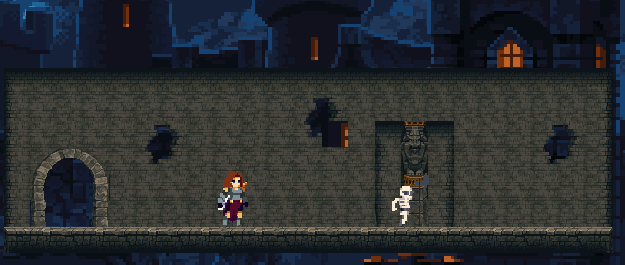

//

Space : Jump  
  W,A,S,D : Movement  
  LeftMouse : Attack  
  RightMouse : CounterAttack  

Upcoming updates : game pause,game exit,skill,UI

tutorial teacher : AlexDev -https://www.youtube.com/@unityalexdev/videos 

